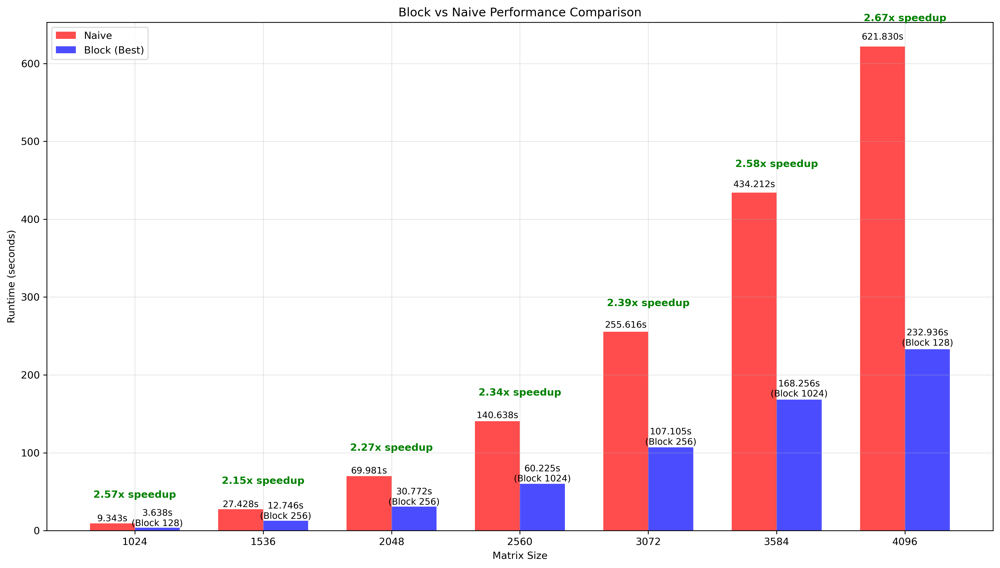

## Solution Explanation

In all implementation, we employ cache-friendly single dimensional arrays of size N * N to represent square matrices. The size of submatrices must divide N.

This has some advantages:
1. All elements are in one continueous block of memory, for example A[1 .. N * N]
2. Only one memory access to reach the element, e.g., A[i * N + j] instead of A[i][j]
3. Adjacent elements for both row-wise and column-wise access offer good spatial locality

### Naive non-blocking implementation

The function is `void matrix_mult_naive(matrix_t *, matrix_t *, matrix_t *, double *)`.

This function uses three nested loop to multiply matrix A by matrix B. In this naive code, we don't apply optimizations, i.e., loop tiling, temperary variables, or parallel computation, etc.

```c
for (int i = 0; i < N; i++)
{
    for (int j = 0; j < N; j++)
    {
        C->mem[i * N + j] = 0.0;
        for (int k = 0; k < N; k++)
        {
            C->mem[i * N + j] += A->mem[i * N + k] * B->mem[k * N + j];
        }
    }
}
```

### Blocked matrix implementation

The function is `void matrix_mult_block(matrix_t *, matrix_t *, int, matrix_t *, double *)`.

#### Loop Tiling

The matrix is divided into `N / block_size` square sub-matrices (called blocks). The three outer loops (`bi`, `bj`, and `bk`) browse through each block. 
- Loops `bi` and `bj` select the result block in matrix C
- Loop `bk` selects blocks in A and B to compute for this block in C
- The inner loops `i`, `j`, and `k` perform actual matrix multiplication.

In additon, we use a temparary variable `sum` to reduce pointer access to `C[i][j]`.

```c
for (int bi = 0; bi < N; bi += block_size)
{
    for (int bj = 0; bj < N; bj += block_size)
    {
        for (int bk = 0; bk < N; bk += block_size)
        {
            int i_end = min(bi + block_size, N);
            int j_end = min(bj + block_size, N);
            int k_end = min(bk + block_size, N);
            
            for (int i = bi; i < i_end; i++)
            {
                for (int j = bj; j < j_end; j++)
                {
                    register double sum = 0; // register variable to store summation
                    for (int k = bk; k < k_end; k++)
                    {
                        sum += A->mem[i * N + k] * B->mem[k * N + j]; // loop tiling
                    }
                    C->mem[i * N + j] = sum;
                }
            }
        }
    }
}
```

#### Cache Benefits

1. Spatial locality: The block is sufficient small, so access to consecutive elements in array `A` is predicted by the CPU for cache optimization.

2. Temperal locality: 
    - Variable `sum` is stored in CPU register for fast access. 
    - Elements from `A[i * N]` to `A[i * N + k]` are reused $blockSize^2$ times within `j` loop.

### Multiplication of matrix blocks using cblas_dgemm in ijk implementation

The function of this implemetation is `matrix_mult_blas_block`.

Instead of three inner loops `i`, `j`, and `k`, this implementation employs Basic Linear Algebra Subprogram (BLAS) to multiply the sub-matrices.

```c
for (int bi = 0; bi < N; bi += block_size)
{
    for (int bj = 0; bj < N; bj += block_size)
    {
        for (int bk = 0; bk < N; bk += block_size)
        {
            int blk_rows = min(block_size, N - bi);
            int blk_cols = min(block_size, N - bj);
            int blk_inner = min(block_size, N - bk);

            cblas_dgemm(
                CblasRowMajor,
                CblasNoTrans,
                CblasNoTrans,
                blk_rows,
                blk_cols,
                blk_inner,
                1.0,
                &A->mem[bi * N + bk],
                N,
                &B->mem[bk * N + bj],
                N,
                1.0,
                &C->mem[bi * N + bj],
                N
            );
        }
    }
}
```

### Non-blocking BLAS dgemm routine

In the function `matrix_mult_cblas`, we invoke BLAS dgemm to multiply A by B.

```c
cblas_dgemm(
    CblasRowMajor,
    CblasNoTrans,
    CblasNoTrans,
    N,
    N,
    N,
    1.0,
    A->mem,
    N,
    B->mem,
    N,
    0.0,
    C->mem,
    N);
```
## Experimental Results

### Environment Specification

The experiment runs on a *Ubuntu Linux* computer of which specifications are:

| Component | Specification |
|-----------|---------------|
| Operating System | Ubuntu Linux |
| Kernel Version | 6.6.87.2 |
| Architecture | x86_64 |
| CPU Model | AMD Processor |
| CPU Count | 16 cores |
| L1 Cache | 32K |
| L2 Cache | 4 MiB |
| L3 Cache | 32 MiB |

### Estimation

We first calculate the maximum block size fitting CPU cache. Let $H$ be the maximum block size, we have:
- One block from matrix A: $H^2$ elements 
- One block from matrix B: $H^2$ elements
- One block from matrix C: $H^2$ elements

In total, there are $3 * H^2$ elements of 64-bit floating point. Thus, CPU cache must be at least $3 * H^2 * 8$ bytes. Or, equivalently,

$$3 * H^2 * 8 \le \text{CPU cache size}$$
$$\iff H \le \sqrt{\frac{\text{CPU cache size}}{3 * 8}}$$

In our program, we only implement one layer cache (check `matrix_mult_block` and `matrix_mult_cblas_block` implementations). Hence, we only take into account the largest L3 Cache. Alternating L3 Cache size of 32 MiB = 33,554,432 bytes to the formula, we obtain $H \le 1182.41335$ bytes. This is the block size's upper bound in the benchmark. 

Secondly, for the ease of estimation, we choose matrix sizes which are multiples of 512. All matrix sizes we run our tests: 1024, 1536, 2048, 2560, 3072, 3584, and 4096. Lastly, for blocking implementations, the chosen block sizes must be common divisors of all matrix sizes. 

### Test Scenarios

Basing on the estimation, we provide the summary table for all test scenarios:

| Implementation | Matrix Size | Block Size | 
|---|---|---|
| Naive | 1024, 1536, 2048, 2560, 3072, 3584, 4096 | |
| Block | 1024, 1536, 2048, 2560, 3072, 3584, 4096 | 16, 128, 256, 512, 1024 |
| CBlas | 1024, 1536, 2048, 2560, 3072, 3584, 4096 | |
| CBlas + Block | 1024, 1536, 2048, 2560, 3072, 3584, 4096 | 16, 128, 256, 512, 1024 |

### Benchmark Results

#### Naive and Block Implementation Comparison

First we look at two blocking implementations: `matrix_mult_block` versus `matrix_mult_naive`:

| Matrix Size | Naive (seconds) | Best Block Block Size | Best Block Time (seconds) | Speedup (Naive/Block) |
|-------------|-----------------|-------------------------|---------------------|-------------------------------|
| 1024 | 9.343332 | 128 | 3.638008 | 2.57x |
| 1536 | 27.428002 | 256 | 12.745546 | 2.15x |
| 2048 | 69.980651 | 256 | 30.772002 | 2.27x |
| 2560 | 140.638135 | 1024 | 60.225147 | 2.34x |
| 3072 | 255.616116 | 256 | 107.104698 | 2.39x |
| 3584 | 434.211685 | 1024 | 168.255812 | 2.58x |
| 4096 | 621.830439 | 128 | 232.936458 | 2.67x |



Key Observations:

-  