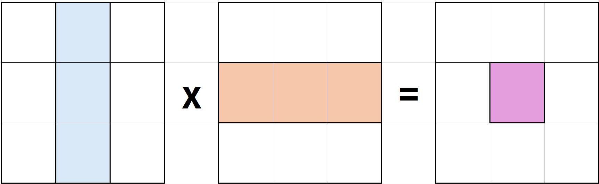
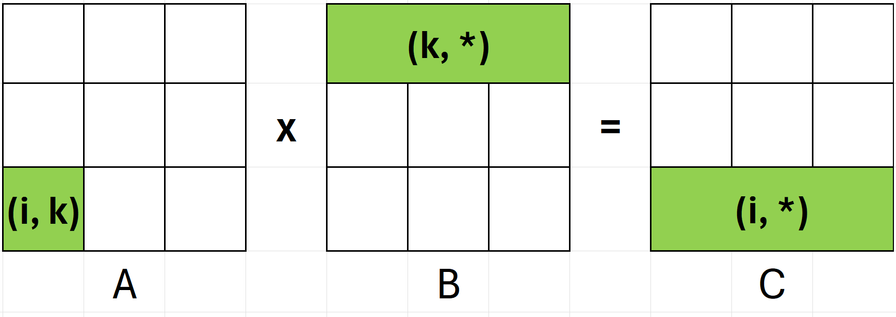
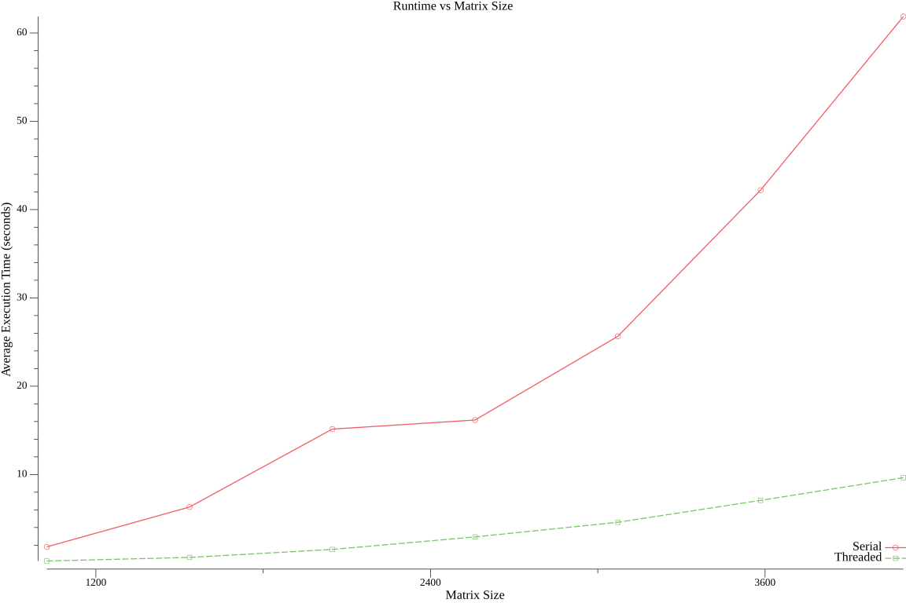
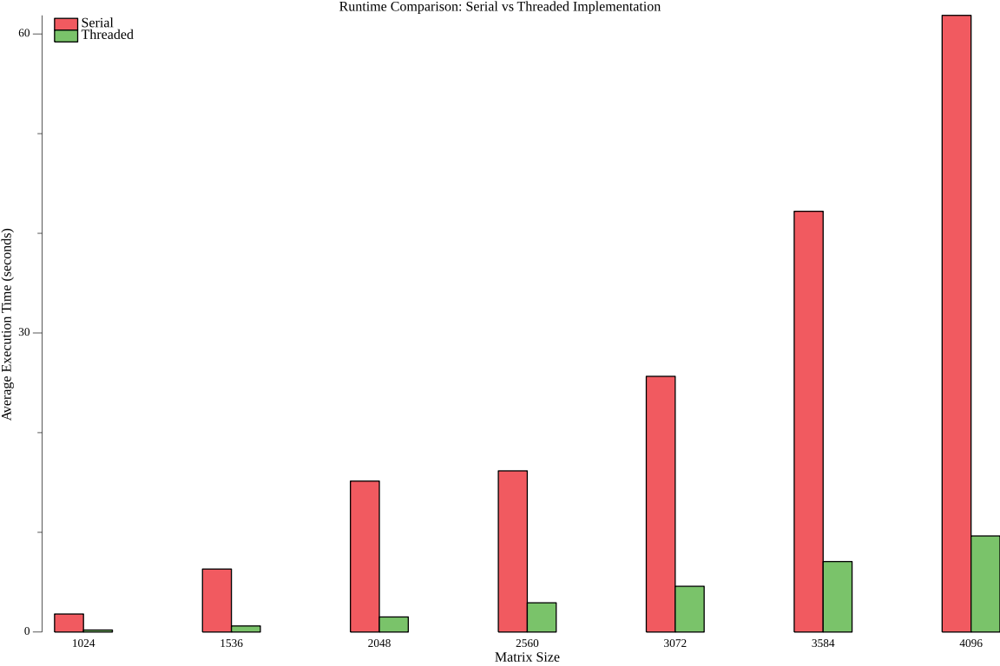

# Solution Explaination

## Serial Implementation

### Norm Calculation

The 1-norm of a matrix is defined as:

$$ \|A\|_1 = \max_{1 \le i \le n}{\sum_{j=1}^{n}{|a_{ij}|}} $$

The function `matrix_norm_serial` process each row entirely and then update the result to the global maximum. Loop tiling is applied to optimize CPU cache.

```c
for (i = 0; i < N; i++)
{
    row = &data[i * N];
    row_sum = 0.0;
    for (bj = 0; bj < N; bj += block_size)
    {
        j_end = MIN(bj + block_size, N);
        for (j = bj; j < j_end; j++)
        {
            row_sum += fabsl(row[j]);
        }
    }
    max_row_sum = MAX(max_row_sum, row_sum);
}
```

### Matrix Multiplication

The function implementing the serial algorithm is `matrix_mult_serial(size_t, matrix_t *, matrix_t *, matrix_t *)`. The algorithm includes the three nested four `kij` loop. It runs in $O(n^3)$ time-complexity.

Four optimization techniques are applied to the serial implementation:

#### Loop tiling

The three outter loops of `bi`, `bj`, and `bk` browse through $\lceil\frac{\text{Matrix Size}}{\text{Block size}}\rceil$ blocks. The block size is optimially selected to maximize cache hits.

```c
for (size_t bi = 0; bi < N; bi += block_size)
{
    for (size_t bj = 0; bj < N; bj += block_size)
    {
        for (size_t bk = 0; bk < N; bk += block_size)
        {
            /*
              ... Inner implementation (see kij ordering) ...
            */
        }
    }
}
```



#### `kij` ordering

The simplified `kij` implementation is as below:

```c
for (k = 0; k < n; k++) {
    for (i = 0; i < n; i++>) {
        int x = A[i][k];
        for (j = 0; j < n; j++) {
            C[i][j] = x * B[k][j];
        }
    }
}

```



In the inner most loop `j`, every elements in `C[i, *]` and `B[k, *]` are accessed `block_size` times. The temporary locality is improved by allowing CPU to efficiently cache row `C[i]` and row `B[k]`. To avoid multiple pointer access to A[i][k], we store `A[i][k]` value to a temporary variable `x`. This technique enhances spatial locality and has cache miss rate in `B` and `C` of $\frac{1}{\text{block size}}$.

The detailed implemenation is provided as below:

```c
const size_t i_end = MIN(bi + block_size, N);
const size_t j_end = MIN(bj + block_size, N);
const size_t k_end = MIN(bk + block_size, N);

for (size_t k = bk; k < k_end; k++)
{
    for (size_t i = bi; i < i_end; i++)
    {
        register const double lhs_data = lhs->data[i * N + k];
        register double *rhs_row = &rhs->data[k * N];
        register double *result_row = &result->data[i * N];
        register const size_t limit = j_end - ((j_end - bj) % 4);
        register size_t j;

        for (j = bj; j < limit; j += 4)
        {
            result_row[j] += lhs_data * rhs_row[j];
            result_row[j + 1] += lhs_data * rhs_row[j + 1];
            result_row[j + 2] += lhs_data * rhs_row[j + 2];
            result_row[j + 3] += lhs_data * rhs_row[j + 3];
        }

        for (; j < j_end; j++)
        {
            result_row[j] += lhs_data * rhs_row[j];
        }
    }
}
```

#### Register variables

```c
register const double lhs_data = lhs->data[i * N + k];
register double *rhs_row = &rhs->data[k * N];
register double *result_row = &result->data[i * N];
register const size_t limit = j_end - ((j_end - bj) % 4);
register size_t j;
```

We store critical variables for the multiplication in register for fast access.

| Variable | Description |
|---|---|
| `lhs_data` | The fixed cell in matrix `A[i][j]`. `lhs` stands for left hand side operands corresponding to matrix `A` in the operation `A * B` |
| `rhs_row` | The $k^{th}$ row of matrix  $B$. `rhs` stands for right hand side. |
| `result_row` | The $i^{th}$ row of result matrix $C$ |

#### Iteration unrolling

We expand a loop to do multiple operations in each iteration. This improves performance by reducing the overhead of loop control. The initial loop is

```c
for (j = bj; j < j_end; j++)
{
    result_row[j] += lhs_data * rhs_row[j];
}
```

By applying iteration unrolling, we process 4 elements per iteration:

```c
for (j = bj; j < limit; j += 4)
{
    result_row[j] += lhs_data * rhs_row[j];
    result_row[j + 1] += lhs_data * rhs_row[j + 1];
    result_row[j + 2] += lhs_data * rhs_row[j + 2];
    result_row[j + 3] += lhs_data * rhs_row[j + 3];
}

for (; j < j_end; j++)
{
    result_row[j] += lhs_data * rhs_row[j];
}
```

## Threaded Implementation

### Norm Calculation

`matrix_norm_threaded` function sets up and manages the parallel norm computation:

1. Work distribution

```c
const size_t N = mat->size;
const size_t PARTITION_SIZE = (size_t)ceil((double)N / (double)num_threads);
```

The matrix is horizontally divided by rows:

- Each thread handles `PARTITION_SIZE` consective rows
- The last thread may process fewer rows if N is not evenly divisible

2. Thread parameter initiation

```c
for (size_t i = 0; i < num_threads; i++)
{
    worker_params[i].mat = mat;
    worker_params[i].shared_max_sum = &shared_result;  // All threads share this
    worker_params[i].mutex = &mutex;                   // All threads share this mutex
    worker_params[i].start_index = i * PARTITION_SIZE;
    worker_params[i].end_index = MIN((i + 1) * PARTITION_SIZE, N);
    worker_params[i].block_size = block_size;

    pthread_create(
        &threads[i],
        NULL,
        matrix_norm_worker,
        (void *)&worker_params[i]);
}
```

3. Result aggregation

One shared variable is used for storing the computation result. A critical section is created at the end of `matrix_norm_worker` for the shared result update.

```c
pthread_mutex_lock(worker_params->mutex);
*(worker_params->shared_max_sum) = MAX(*(worker_params->shared_max_sum), local_max_sum);
pthread_mutex_unlock(worker_params->mutex);
```

### Matrix Multiplication

The main function that is responsible for parallel matrix multiplication is `matrix_mult_threaded`. The function has 5 main steps:

1. Setup thread and allocate memory

```c
const size_t N = lhs->size;
const size_t PARTITION_SIZE = (size_t)ceil((double)N / (double)num_threads);
pthread_t *threads;
matrix_mult_worker_params_t *worker_params;

threads = (pthread_t *)calloc(num_threads, sizeof(pthread_t));
worker_params = (matrix_norm_worker_params_t *)calloc(num_threads, sizeof(matrix_norm_worker_params_t));
```

This code estimates the number of rows each thread will handle `PARTITION_SIZE` and allocates the arrays of work threads and their parameters.

2. Work distribution

```c
worker_params[i].block_start_index = i * PARTITION_SIZE;
worker_params[i].block_end_index = MIN((i + 1) * PARTITION_SIZE, N);
```

The matrix is divided among threads horizontally, for example:

- Thread 0: rows 0 to `PARTITION_SIZE - 1`
- Thread 1: rows `PARTITION_SIZE` to `2 * PARTITION_SIZE - 1`
- Thread i-th: rows `i * PARTITION_SIZE` to `(i + 1) * PARTITION_SIZE - 1`

3. Separate result buffers

```c
worker_params[i].result = (double *)calloc(N * N, sizeof(double));
```

Each thread has a complete individual NxN result matrix. This avoid race-condition without using locking mechanism, e.g., mutexes, which serverely drags the performance down due to overheads.

4. Thread creation and execution

```c
pthread_create(&threads[i], NULL, matrix_mult_worker, (void *)&worker_params[i]);
```

5. Result aggregation

```c
for (size_t i = 0; i < num_threads; i++)
{
    pthread_join(threads[i], NULL);
    for (size_t j = 0; j < N * N; j++)
    {
        result->data[j] += worker_params[i].result[j];
    }
    free(worker_params[i].result);
}
```

# Experiment Results

The system configurations in which the tests are performed are:

| Component | Specification |
|-----------|---------------|
| Operating System | Ubuntu Linux |
| Kernel Version | 6.6.87.2 |
| Architecture | x86_64 |
| CPU Model | AMD Processor |
| CPU Count | 16 cores |
| L1d Cache | 32K |
| L2 Cache | 4 MiB |
| L3 Cache | 32 MiB |

Based on the system information, we conducted the experiments with the matrix size of 512-multiples. The block size is 512 to fit the CPU caches and divides all matrix sizes. Second, the number of threads in the parallel test matches the CPU core number, that is, 16.

Each test scenario is run fifty times and the runtime of each run is recorded for average estimation.

| Test Type | Matrix Size | Block Size | Number of Threads | Number of Iterations | Implementation |
|-----------|-------------|------------|-------------------|---------------------|----------------|
| Serial    | 1024        | 512        | 1                 | 50                  | serial         |
| Serial    | 1536        | 512        | 1                 | 50                  | serial         |
| Serial    | 2048        | 512        | 1                 | 50                  | serial         |
| Serial    | 2560        | 512        | 1                 | 50                  | serial         |
| Serial    | 3072        | 512        | 1                 | 50                  | serial         |
| Serial    | 3584        | 512        | 1                 | 50                  | serial         |
| Serial    | 4096        | 512        | 1                 | 50                  | serial         |
| Threaded  | 1024        | 512        | 16                | 50                  | threaded       |
| Threaded  | 1536        | 512        | 16                | 50                  | threaded       |
| Threaded  | 2048        | 512        | 16                | 50                  | threaded       |
| Threaded  | 2560        | 512        | 16                | 50                  | threaded       |
| Threaded  | 3072        | 512        | 16                | 50                  | threaded       |
| Threaded  | 3584        | 512        | 16                | 50                  | threaded       |
| Threaded  | 4096        | 512        | 16                | 50                  | threaded       |

The experimental results table is:

| Matrix Size | Serial Time (s) | Threaded Time (s) | $\frac{\text{Threaded Time}}{\text{Serial Time}}$ |
|-------------|-----------------|-------------------|---------|
| 1024        | 1.809551        | 0.206279          | 8.77    |
| 1536        | 6.319773        | 0.611323          | 10.34   |
| 2048        | 15.141643       | 1.514556          | 10.00   |
| 2560        | 16.170770       | 2.935385          | 5.51    |
| 3072        | 25.652109       | 4.590539          | 5.59    |
| 3584        | 42.207631       | 7.070302          | 5.97    |
| 4096        | 61.862645       | 9.640536          | 6.42    |

## The Dependency of Matrix Size and Runtime



#### Key Observations:

- As matrix size increases, the serial runtime grows much faster than the parallel one. 
- 

## The Speedup 



#### Key Observations:

- 

# References

- [Cache Effect in Matrix Multiplication. Tutorial for Assignment 1](https://csmoodle.ucd.ie/moodle/pluginfile.php/211222/mod_resource/content/1/tutorialForAssign1.pdf)
- [Wikipedia - Loop unrolling](https://en.wikipedia.org/wiki/Loop_unrolling)
